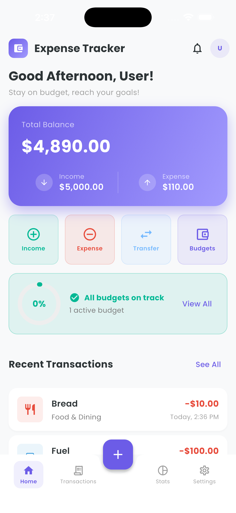
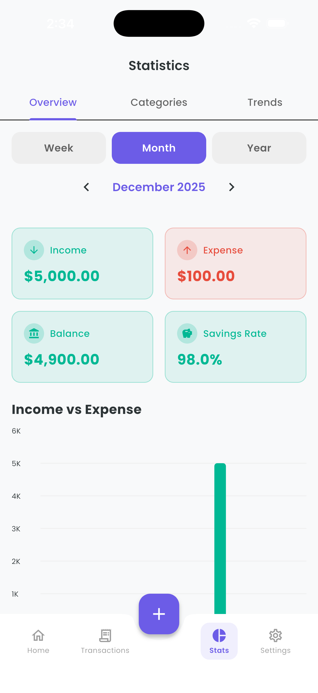
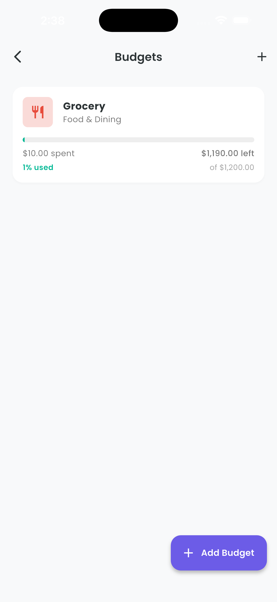
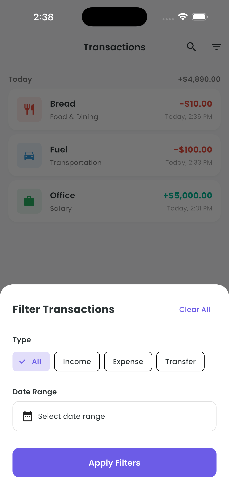
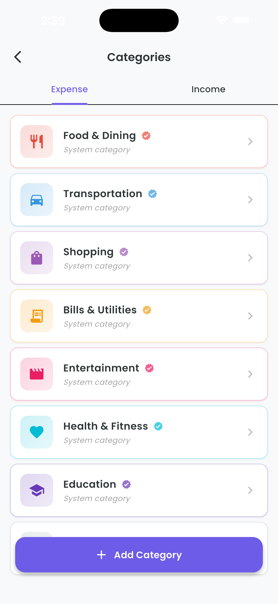
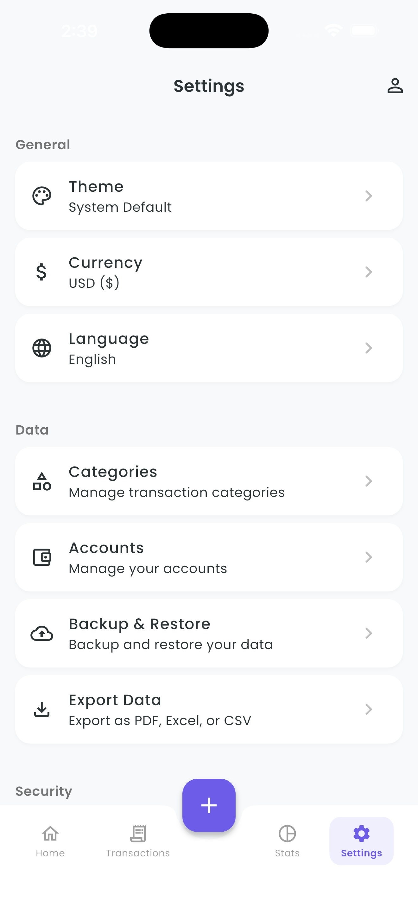
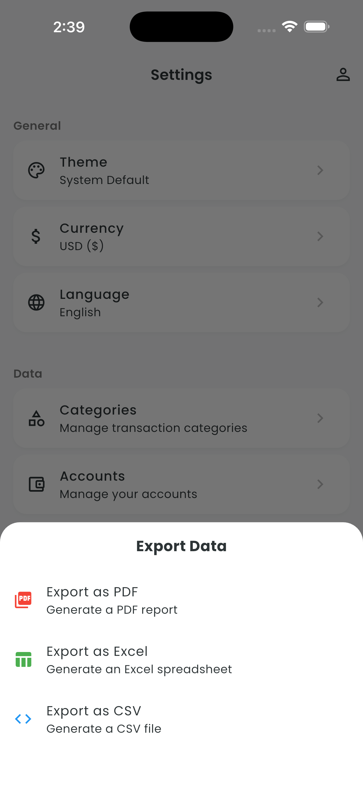

# 💰 Expense Tracker

A comprehensive, feature-rich expense tracking application built with Flutter. Manage your finances with multiple accounts, budgets, detailed analytics, and complete data security.

## 📱 Screenshots

| Home | Stats | Accounts | Budgets |
|------|-------|----------|---------|
|  |  |  |  |

| Transactions | Categories | Settings | Export |
|--------------|------------|----------|--------|
|  |  |  |  |

## ✨ Features

### 💵 Financial Management
- Track income, expenses, and transfers
- Multiple accounts support (Cash, Bank, Cards, etc.)
- Multi-currency support
- Show/hide balance for privacy

### 📊 Analytics & Insights
- Visual charts for spending patterns
- Stats by week, month, and year
- Category-wise breakdown
- Income vs expense trends
- Cashflow surplus tracking

### 🎯 Budgets
- Create multiple budgets
- Budget alerts when limits approach
- Track spending against budget goals

### 🗂️ Organization
- Predefined + custom categories
- Transaction history with search
- Filter by type and date range
- Daily reminders

### 🔐 Security
- Biometric authentication (Fingerprint/Face)
- PIN lock option
- Secure data storage

### 💾 Data Management
- Backup and restore
- Export to PDF and Excel with branding
- Clear data option

### 🎨 User Experience
- Dark and Light theme
- Localization support
- Clean, intuitive interface

## 🛠️ Tech Stack

| Category | Technology |
|----------|------------|
| Framework | Flutter |
| State Management | Provider |
| Local Database | SQLite + Hive |
| Charts | fl_chart |
| Security | local_auth |
| Export | pdf, excel, printing |
| Notifications | flutter_local_notifications |

## 🚀 Getting Started

### Prerequisites
- Flutter SDK ^3.10.0
- Android Studio / VS Code

### Installation

```bash
# Clone the repository
git clone https://github.com/sanaullah/expense_tracker.git

# Navigate to project
cd expense_tracker

# Install dependencies
flutter pub get

# Run the app
flutter run